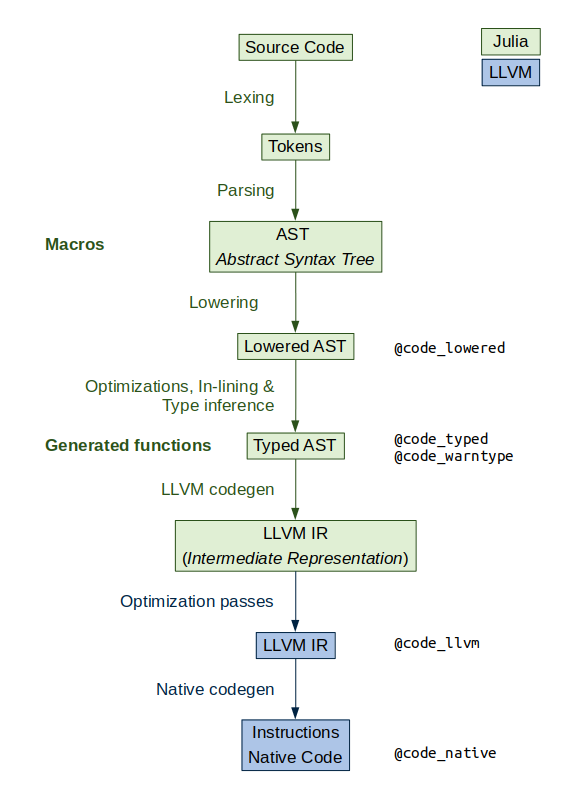

```@meta
EditURL = "https://github.com/TRAVIS_REPO_SLUG/blob/master/"
```

# How Julia works?

[](https://mybinder.org/v2/gh/TRAVIS_REPO_SLUG/gh-pages?filepath=TRAVIS_TAG/notebooks/04_HowJuliaWorks.ipynb)
[](https://nbviewer.jupyter.org/github/TRAVIS_REPO_SLUG/blob/gh-pages/TRAVIS_TAG/notebooks/04_HowJuliaWorks.ipynb)

## Type system

Until now, we have not used type annotations, but Julia has a rich type system.
Julia is an optionally- and dynamically-typed programming language. That means
that you can change the type of a variable...

```@example 04_HowJuliaWorks
a = 10
typeof(a)
```

```@example 04_HowJuliaWorks
a = true
typeof(a)
```

... and that type annotations are optional. You can use type annotations to:
 - make a program more robust (type checking)

```@example 04_HowJuliaWorks
a::Bool # type assertion
```

```@example 04_HowJuliaWorks
a::Int
```

 - optimize code by giving a hint to the compiler
 - documment the code and use multiple dispatch

```@example 04_HowJuliaWorks
# function_name(arg::ArgumentType)::ReturnType = function_body
first_character(str::AbstractString)::Char = str[1]
```

```@example 04_HowJuliaWorks
character = first_character("ABC")
```

```@example 04_HowJuliaWorks
character = first_character(10_000)
```

### Type hierarchy

Any Julia object has a type that belongs to a fully connected type graph.
There are abstract and concrete types. Concrete types are final, i.e. they
cannot have subtypes, while abstract types can have multiple subtypes but
only one supertype.

```@example 04_HowJuliaWorks
using JuliaForBioinformatics
show_type_tree(Number)
```

In Julia, all values are instances of the abstract type `Any`.

The functions supertype and subtypes are useful to navegate the type graph.

```@example 04_HowJuliaWorks
supertype(Real)
```

```@example 04_HowJuliaWorks
subtypes(Real)
```

You can use `isa` to test if an object is of a given type

```@example 04_HowJuliaWorks
isa("I'm a string", String)
```

And the subtype operator `<:` to test if a type is a subtype of another

```@example 04_HowJuliaWorks
String <: AbstractString
```

You can also use `Union` of types, for example, if the possible types don't
share a meaningful supertype

```@example 04_HowJuliaWorks
String <: Union{AbstractString, AbstractChar}
```

### Multiple dispatch

We can define multiple [methods](https://docs.julialang.org/en/v1/manual/methods/#Methods-1)
for a function by using different method signatures by indicating the argument
types using `::` or `<:`.

For example we are going to define 3 methods for the function `say_my_type`:

```@example 04_HowJuliaWorks
say_my_type(x) = println(x, " is a ", typeof(x))
# say_my_type(x) is the same that say_my_type(x::Any)

say_my_type(x::Real) = println(x, " is a Real number of type ",  typeof(x))
say_my_type(x::Float64) = println(x, " is a Float64 number")
```

When the function is called, Julia selects the method with the most specific
method signature.

```@example 04_HowJuliaWorks
say_my_type('A') # 'A' is a Char, a subtype of Any
say_my_type(2) # 2 is an Int, a subtype of Real
say_my_type(2.0)
```

`say_my_type(x::Real)` can also be written using the `where` keyword as

```@example 04_HowJuliaWorks
say_my_type(x::T) where {T <: Real} = println(x, " is a Real number of type ",  T)
```

```@example 04_HowJuliaWorks
methods(say_my_type)
```

### Parametric types

Julia types can have parameters. We have already used parametric types, one
of them is Array:

```@example 04_HowJuliaWorks
three_d_array = zeros(Int, 4, 3, 2)
```

```@example 04_HowJuliaWorks
typeof(three_d_array)
```

Julia Arrays take two parameters, the type of the elements stored in the array
and the array dimensions.

This allows to write specific methods depending on those parameters

```@example 04_HowJuliaWorks
say_my_type(x::Array{T, 1}) where {T} = println(x, " is vector with ",  T, " elements")
say_my_type(x::Array{T, 2}) where {T} = println(x, " is matrix with ",  T, " elements")
```

```@example 04_HowJuliaWorks
say_my_type(Rational[0.5, 1, 1.5])
say_my_type(Float64[1 3 5; 2 4 6])
```

#### Exercise 1

Add a method to `say_my_type` that prints the number of unique values of an
array of characters or strings and its dimensions. Hint: You can use the
`unique` function.

```@example 04_HowJuliaWorks
# ... println(x, " is a text array with ... dimensions and ... unique values of type ...
```

That means that the function call:
```julia
test_array = ['a', 'b', 'b']
say_my_type(test_array)
```
Should print something like:
```
['a', 'b', 'b'] is a text array with 1 dimensions and 2 unique values of type Char
```

### Which method is being used?

You can use the `@which` macro to ask Julia which method is being used

```@example 04_HowJuliaWorks
@which say_my_type(2 + 0im)
```

```@example 04_HowJuliaWorks
@which say_my_type(2.0)
```

### Julia compiler

Julia uses Just-in-time (JIT) compilation to achieve close to C performance.
After selecting the most specific method, Julia (generally) compiles the
method for the particular argument types.

For this reason, the first time a function is called, it is compiled (slow).
If you call the same function a second time with the same argument types, it
will use the already compiled code (fast).

```@example 04_HowJuliaWorks
@time sum(1:10_000)
```

```@example 04_HowJuliaWorks
@time sum(1:10_000)
```

While compilation times can be annoying sometimes, this mechanism allows
Julia generality, composability and its capacity to generate efficient code
for user-defined types. That's mean that you do not need to use built-in
types or functions or to code some parts in C/Fortran to get a good
performance like in other high-level languages.


Also, Julia represents its own code as a Julia data structure. This allows a
program to transform and generate its own code, using **macros** and
**generated functions**, for example, and powerful reflection capabilities
to explore the internals of a program. You can read the
[metaprogramming section of the manual](https://docs.julialang.org/en/v1/manual/metaprogramming/)
to learn more about this topic.

```@example 04_HowJuliaWorks
##?@elapsed
```

```@example 04_HowJuliaWorks
macroexpand(Main, :(@elapsed sum(1:10_000)))
```



```@example 04_HowJuliaWorks
function sum_numbers(vector)
    total = 0
    for value in vector
        total += value
    end
    total
end
```

To avoid performance issues for using a
[global variable](https://docs.julialang.org/en/v1/manual/performance-tips/index.html#Avoid-global-variables-1)
we are going to define it as a constant using the
[const keyword.](https://docs.julialang.org/en/v1/base/base/#const)

```@example 04_HowJuliaWorks
const rand_vector = rand(5)
```

```@example 04_HowJuliaWorks
@code_lowered sum_numbers(rand_vector)
```

```@example 04_HowJuliaWorks
@code_typed sum_numbers(rand_vector)
```

```@example 04_HowJuliaWorks
@code_warntype sum_numbers(rand_vector)
```

```@example 04_HowJuliaWorks
@code_llvm sum_numbers(rand_vector)
```

```@example 04_HowJuliaWorks
@code_native sum_numbers(rand_vector)
```

#### Exercise 2

Modify the `sum_numbers` function to make it
[type stable](https://docs.julialang.org/en/v1/manual/performance-tips/#Write-%22type-stable%22-functions-1)
by using `zero` and `eltype`. Then compare the output of the previous
`@code_`* macros.

```@example 04_HowJuliaWorks
function sum_numbers(vector)
    total = 0
    for value in vector
        total += value
    end
    total
end
```

Check that you don't have any warning in the output of `@code_warntype`:

```@example 04_HowJuliaWorks
@code_warntype sum_numbers(rand_vector)
```

*This page was generated using [Literate.jl](https://github.com/fredrikekre/Literate.jl).*

